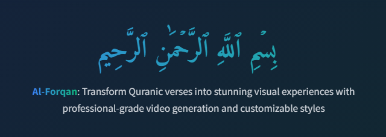
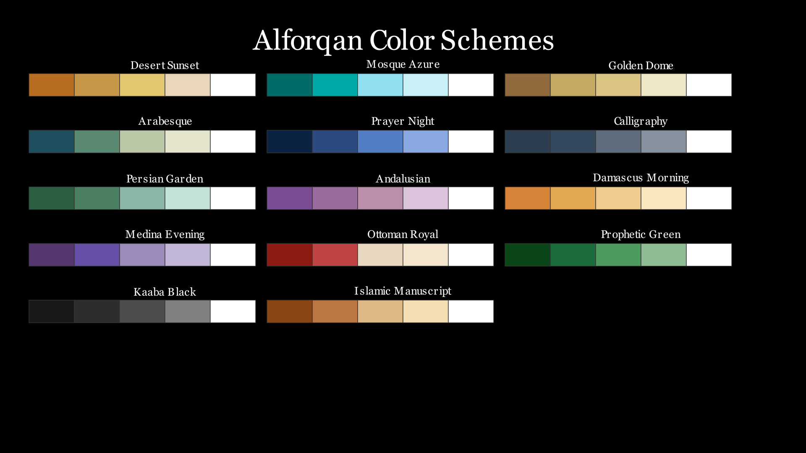
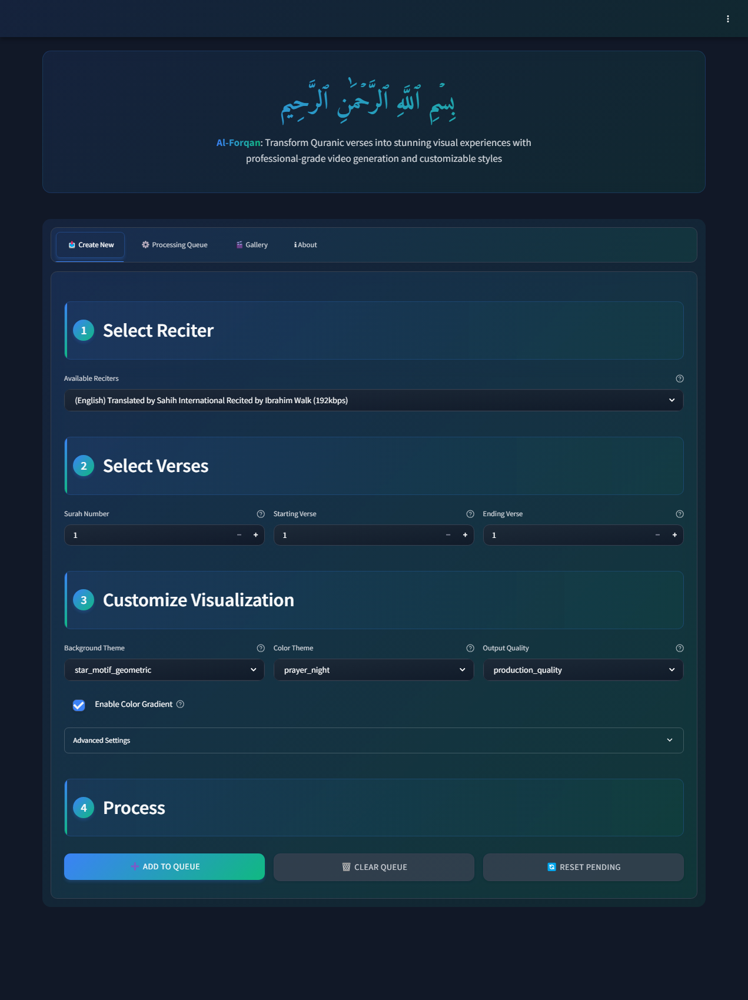
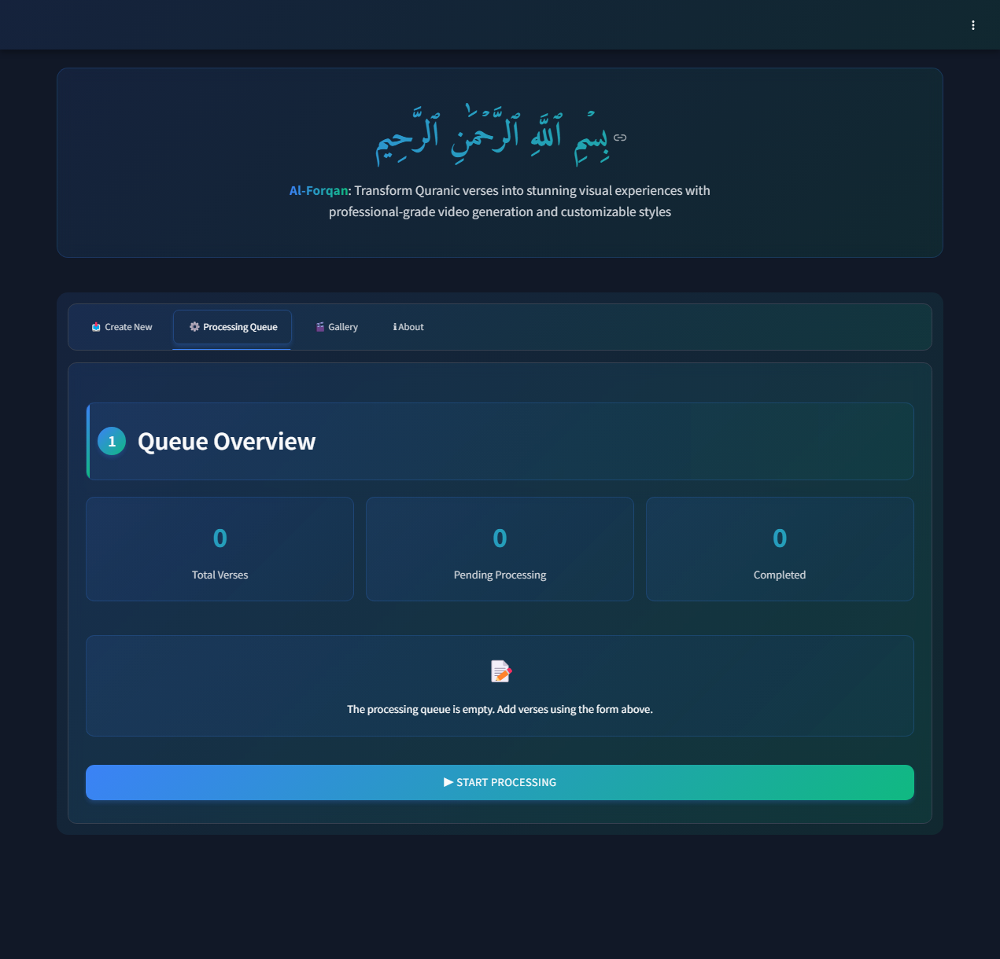
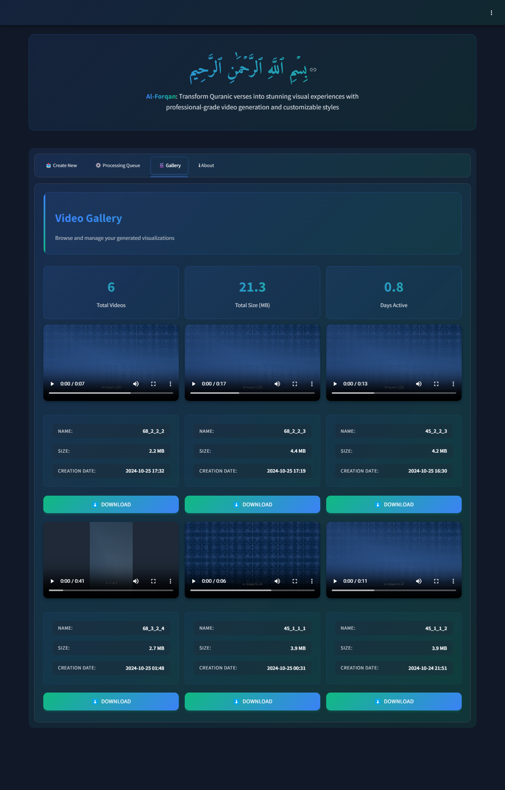
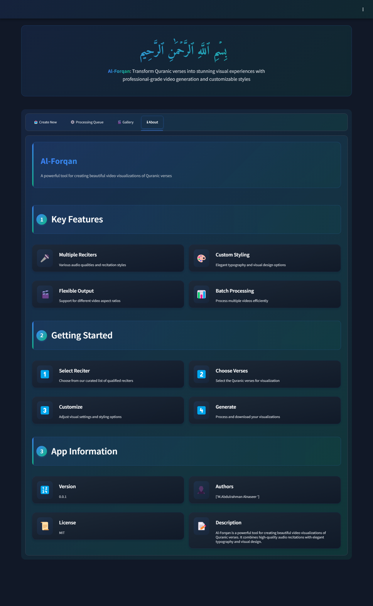

<div align="center">
  

# 🕌 Al-Forqan: Quranic Video Generator

[](LICENSE)


[](https://github.com/sponsors/abdalrohman)

Transform Quranic verses into stunning visual experiences with professional-grade video generation and customizable
styles.
</div>

## 📖 Table of Contents

- [🌟 Key Features](#-key-features)
- [📸 Screenshots](#-screenshots)
- [🛠️ Prerequisites](#-prerequisites)
- [⚡ Quick Start](#-quick-start)
- [💡 Usage Examples](#-usage-examples)
- [⚙️ Configuration](#-configuration)
- [🤝 Contributing](#-contributing)
- [🚀 Deployment](#-deployment)
- [🛠️ Built With](#-built-with)
- [👥 Authors & Contributors](#-authors--contributors)
- [📜 License](#-license)
- [🙏 Acknowledgments](#-acknowledgments)
- [❓ FAQ](#-faq)
- [🔮 Roadmap](#-roadmap)

### Project Description

Al-Forqan is an open-source Python project that empowers users to create captivating video visualizations of Quranic
verses. It leverages the Manim animation library for high-quality video generation, integrates with EveryAyah.com for
Quranic audio downloads, and offers a user-friendly Streamlit interface for customization and processing.

## 📸 Screenshots

<details>
<summary><b>View Gallery</b> (Click to expand) 🖼️</summary>

### 🎨 Available Color Schemes

<p align="center">
  
</p>

### 📱 App Interface

<table>
  <tr>
    <td align="center"><b>Main Page</b></td>
    <td align="center"><b>Queue Page</b></td>
  </tr>
  <tr>
    <td></td>
    <td></td>
  </tr>
  <tr>
    <td align="center"><b>Gallery Page</b></td>
    <td align="center"><b>About Page</b></td>
  </tr>
  <tr>
    <td></td>
    <td></td>
  </tr>
</table>

</details>

## 🌟 Key Features

- **Professional Video Generation:** Create high-quality videos with customizable styling and animations.
- **Quranic Audio Integration:** Choose from a curated list of reciters with various audio qualities.
- **Customizable Visuals:** Select background themes, color schemes, and typography to match your preferences.
- **Batch Processing:** Process multiple verses efficiently for creating a collection of visualizations.
- **User-Friendly Interface:** An intuitive web application makes it easy to generate videos.

## 🛠️ Prerequisites

- **Python 3.10+:**  Ensure you have Python installed on your system.
- **Streamlit:**  Install the Streamlit library for the web application: `pip install streamlit`
- **Manim:**  Install the Manim animation library: `pip install manim`
- **Mutagen:**  Install the Mutagen library for audio file handling: `pip install mutagen`
- **Pydub:**  Install the Pydub library for audio processing: `pip install pydub`
- **requests:**  Install the Requests library for downloading audio files: `pip install requests`
- **fontTools:**  Install the fontTools library for font management: `pip install fonttools`
- **structlog:**  Install the structlog library for structured logging: `pip install structlog`

## ⚡ Quick Start

### Installation

```bash
# Clone the repository
git clone https://github.com/abdalrohman/alforqan.git

# Navigate to project directory
cd repo

# Install dependencies
pip install -r requirements.txt

# Start the application
streamlit run app.py
```

## 💡 Usage Examples

### Generating a Video of Al-Fatiha

1. **Select Reciter:** Choose "Abdullah Basfar (192kbps)" from the "Available Reciters" dropdown.
2. **Select Verses:** Set "Surah Number" to 1, "Starting Verse" to 1, and "Ending Verse" to 7.
3. **Customize Visualization:** Choose a background theme, color scheme, and video quality. Enable or disable the
   gradient effect.
4. **Process:** Click "➕ Add to Queue" to add the verses to the processing queue.
5. **Start Processing:** Click "▶️ Start Processing" to generate the video.

### Viewing the Video Gallery

1. **Navigate to the "🎬 Gallery" tab.**
2. **Browse through the generated videos.**
3. **Download videos:** Click the "Download" button to download a video.

## ⚙️ Configuration

- **`config.toml`:**  This file contains the application's settings, including font paths, Quran data file location, and
  visual style defaults.
- **`visualization_config` (in `gui.py`):**  This dictionary stores the user's selected visualization settings.

## 🤝 Contributing

We welcome contributions! Please follow these steps:

1. Fork the repository
2. Create a new branch: `git checkout -b feature-name`
3. Make your changes
4. Run the linter: `ruff format .`
5. Commit your changes: `git commit -m 'Add feature'`
6. Push to the branch: `git push origin feature-name`
7. Submit a pull request

## 👥 Contributors & Community

<div align="center">

### 🌟 Core Team

<a href="https://github.com/abdalrohman">
  <br />
  <sub><b>M.Abdulrahman Alnaseer</b></sub>
</a>
<br />
<sub>Project Creator & Maintainer</sub>

### ✨ Contributors

<a href="https://github.com/abdalrohman/al-forqan/graphs/contributors">
  
</a>

### 🤝 How to Contribute

<p align="center">
🐛 <a href="https://github.com/abdalrohman/al-forqan/issues/new?template=bug_report.md">Report a Bug</a>
<br/>
💡 <a href="https://github.com/abdalrohman/al-forqan/issues/new?template=feature_request.md">Suggest a Feature</a>
<br/>
📖 Help improve documentation or add translations
<br/>
💻 Submit a PR to fix bugs or add features
</p>

### 🌱 First-Time Contributors

<p align="center">
Looking to make your first contribution? Check out:
<br/><br/>
<a href="https://github.com/abdalrohman/al-forqan/issues?q=is%3Aissue+is%3Aopen+label%3A%22good+first+issue%22">
  
</a>
<a href="https://github.com/abdalrohman/al-forqan/issues?q=is%3Aissue+is%3Aopen+label%3A%22help+wanted%22">
  
</a>
</p>

### 💖 Support the Project

<p align="center">
⭐ Star the repository
<br/>
🔄 Share it with others
<br/>
📣 Write about it on your blog
<br/>
☕ <a href="https://github.com/sponsors/abdalrohman">Sponsor the creator</a>
</p>

</div>

## 🚀 Deployment

- **Streamlit Cloud:** Deploy your application to Streamlit Cloud for easy sharing and collaboration.
- **Heroku:**  Deploy your application to Heroku for a scalable cloud hosting solution.

## 🛠️ Built With

- **Streamlit:** Web application framework
- **Manim:** Animation library
- **Mutagen:** Audio file handling
- **Pydub:** Audio processing
- **requests:** HTTP requests
- **fontTools:** Font management
- **structlog:** Structured logging

## 👥 Authors & Contributors

<div align="center">
  <a href="https://github.com/abdalrohman/al-forqan/graphs/contributors">
    
  </a>
</div>

Created by [M.Abdulrahman Alnaseer](https://github.com/abdalrohman) - Feel free to reach out!

## 📜 License

This project is licensed under the MIT License - see the [LICENSE](LICENSE) file for details.

### Acknowledgments

- The project is inspired by the Quranic audio resources available on EveryAyah.com.
- Thanks to the Manim community for the powerful animation library.
- Special thanks to the developers of Streamlit for the user-friendly web framework.

## 🙏 Acknowledgments

- **EveryAyah.com:**  For providing the Quran recitation audio data.
- **The Quran Complex:** For providing the Uthmanic Hafs Quran text data.
- **The Manim Community:** For creating the amazing Manim animation library.
- Special thanks to the developers of **Streamlit** for the user-friendly web framework.
- **All contributors:** For their valuable contributions and support.

## ❓ FAQ

- **Q: How do I choose a reciter?**
    - **A:** Use the "Available Reciters" dropdown to select from a curated list of reciters.
- **Q: What are the different video qualities?**
    - **A:** The "Output Quality" dropdown lets you choose between "production_quality" (high quality) and "
      preview_quality" (faster rendering).
- **Q: How do I customize the visuals?**
    - **A:** Use the "Background Theme," "Color Theme," and "Enable Color Gradient" options to personalize your
      visualizations.
- **Q: Can I use this project to create commercial videos?**
    - **A:** Yes, you are free to use this project for commercial purposes. However, please make sure to comply with the
      licensing terms of the used libraries and datasets.

## 🔮 Roadmap

- Add support for more Quran reciters.
- Save the user configuration instead of using `visualization_config` dictionary.
- Implement customize the animation style.
- Add support for speed the video with specific time.
- Optimize the code to be able generating long video.
- Improve the user interface with more customization options.
- Visualize of the chosen verse.
- Optimize the code for more efficient and less resources consuming.
- Add support for more quran data and custom one from user.
- 